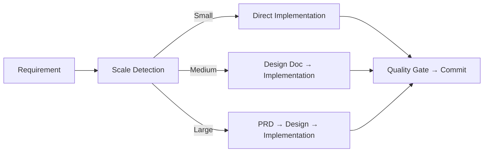

# 🤖 Antigravity × PayloadCMS Boilerplate

> **Agentic coding TypeScript boilerplate** — Sub-agent workflows, built-in quality checks, and context engineering for building production-ready Payload CMS + Next.js applications.

[](https://www.typescriptlang.org/)
[](https://payloadcms.com/)
[](https://nextjs.org/)
[](https://bun.sh/)
[](https://antigravity.dev/)
[](https://opensource.org/licenses/MIT)

## 📖 Table of Contents
1. [Quick Start](#-quick-start)
2. [Updating Existing Projects](#-updating-existing-projects)
3. [Why Agentic Coding?](#-why-agentic-coding)
4. [Skills System](#-skills-system)
5. [Agentic Workflow Commands](#-agentic-workflow-commands)
6. [Development Workflow](#-development-workflow)
7. [Tech Stack](#-tech-stack)
8. [Architecture: FBA-SOLID-SSOT](#-architecture-fba-solid-ssot)
9. [Project Structure](#-project-structure)
10. [Testing](#-testing)
11. [FAQ](#-faq)

---

## ⚡ Quick Start

### 🔐 Authenticating with GitHub Packages

This boilerplate is published securely via the GitHub Packages registry. Before you can download it via `npx`, you must authenticate your machine by creating a global `.npmrc` file.

1. **Get your Access Key**: This is provided to you upon purchasing the Ebook/Class. It acts as both your NPM authentication token and your Agent setup token.
2. **Create the `.npmrc` file in your home directory**:
   - **Mac/Linux:** `~/.npmrc`
   - **Windows:** `C:\Users\YourUsername\.npmrc`
3. Add the following content to the file, replacing `PAID_ACCESS_KEY` with the token provided in the class:
```ini
@kelasvibecoding:registry=https://npm.pkg.github.com/
//npm.pkg.github.com/:_authToken=PAID_ACCESS_KEY
```

### Setup Scripts

```bash
# Standard setup (SQLite — default, no DB required)
npx @kelasvibecoding/payload-base-bun my-project
cd my-project && bun install && bun dev

# With Postgres pre-configured in .env
npx @kelasvibecoding/payload-base-bun my-project --db=postgres

# With MongoDB pre-configured in .env
npx @kelasvibecoding/payload-base-bun my-project --db=mongodb

# With Agent Ability (Access Key required — Ebook/Class purchase)
npx @kelasvibecoding/payload-base-bun my-project --ability

# Mobile layout variant (max-width: 480px)
npx @kelasvibecoding/payload-base-bun my-project --mobile

# Show all options
npx @kelasvibecoding/payload-base-bun --help
```

> See [Getting Started Guide](docs/guides/getting-started.md) for full setup options.

---

## 🔄 Updating Existing Projects

Inject or update the Antigravity agent configurations (`.agent/`) into your existing **Payload CMS** project — without touching your source code.

**Prerequisites**: The script auto-detects Payload CMS by checking for `src/payload.config.ts` in your project root. Your project must have this file for the injection to be valid.

```bash
# Inject Agent Ability into your existing Payload CMS project
npx @kelasvibecoding/payload-base-bun --abilityonly
```

You will be prompted for your **Access Key**. The script will then:

1. ✅ Verify `src/payload.config.ts` exists (confirms Payload CMS project)
2. 📥 Clone the latest agent configurations
3. 🔄 Merge `.agent/` rules, workflows, and skills into your project
4. 🧹 Clean up temporary files

### What Gets Updated

| Target | Path | Contents |
|--------|------|----------|
| Agent rules | `.agent/rules/` | 35+ modular Payload-specific rules |
| Workflows | `.agent/workflows/` | `/implement`, `/plan`, `/review`, `/diagnose`, `/adr` |
| Skills | `.agent/skills/` | Payload, FBA, Media, E2E, Zod, UI/UX skills |

Your `src/`, `package.json`, `payload.config.ts`, and all project files are **never touched**.

---

## 🚀 Why Agentic Coding?

Traditional AI coding struggles with:
- ❌ Losing context in long sessions
- ❌ Declining code quality over time
- ❌ No architectural enforcement

**This boilerplate solves it through:**
- ✅ Structured workflows that enforce FBA-SOLID-SSOT on every feature
- ✅ Built-in quality gates (lint, typecheck, E2E) before every commit
- ✅ Auto-stop protocol that prevents runaway sessions
- ✅ Context-engineered rules tuned to Payload CMS 3.0 patterns

---

## 🎨 Skills System

Skills are AI context packs loaded automatically when working in specific areas. They give your agent deep, domain-specific knowledge without manual prompting.

### Core Skills

| Skill | Purpose |
|-------|---------|
| `payload-cms-development` | Payload collections, hooks, access control, endpoints |
| `payload-cms-docs` | Official Payload CMS 3.0 reference documentation |
| `fba-solid-ssot` | Feature-Based Architecture + SOLID + Single Source of Truth |
| `feature-based-architecture` | FBA patterns and directory structure guidelines |
| `senior-fullstack` | Production-grade patterns for Payload + Next.js |
| `software-architecture` | System design, architectural decision-making |

### Frontend & UI Skills

| Skill | Purpose |
|-------|---------|
| `ui-ux-stack` | Shadcn UI, Tailwind CSS 4, design system patterns |
| `vibe-blocks` | 2,000+ UI component library (Relume + Custom/Shadcn) |
| `web-design-guidelines` | Accessibility, UX best practices, design auditing |
| `vercel-react-best-practices` | React/Next.js performance optimization (Vercel) |
| `performance-lockdown` | 100/100 Lighthouse: Zero-JS shell, TBT optimization |
| `performance-mastery` | App Router responsiveness, streaming, Suspense |

### Data & Validation Skills

| Skill | Purpose |
|-------|---------|
| `payload-option-sync` | Sync Payload select options → Zod → Frontend (SSOT) |
| `zod-form-validation` | Zod + React Hook Form + Payload schema alignment |
| `media-mastery` | Image optimization, Sharp, next/image, WebP/AVIF |

### Tooling Skills

| Skill | Purpose |
|-------|---------|
| `code-intelligence` | ast-grep structural search, advanced refactoring |
| `skill-rule-creator` | Creating new skills and agent rules |

### Document & File Skills

| Skill | Purpose |
|-------|---------|
| `docx-mastery` | .docx creation, editing, tracked changes |
| `pdf-mastery` | PDF extraction, generation, form filling |
| `pptx-mastery` | PowerPoint creation and OOXML editing |
| `xlsx-mastery` | Excel modeling, formulas, financial data |

---

## 🤖 Agentic Workflow Commands

| Command | Purpose | When to Use |
|---------|---------|-------------|
| `/implement` | Scale-aware full lifecycle: detect → plan → code → verify | Any new feature |
| `/start` | Environment initialization | Right after cloning |
| `/plan` | Generate design doc in `docs/design/` | Before coding |
| `/review` | FBA-SOLID-SSOT + security compliance check | Post-implementation |
| `/diagnose` | Root cause analysis (5-Whys) | Debugging |
| `/reverse-engineer` | Generate PRD + Design Doc from existing code | Documentation, onboarding, pre-refactor |
| `/adr` | Architecture Decision Record in `docs/adr/` | Irreversible decisions |
| `/lint-typecheck` | Generate types, lint, typecheck | Before committing |
| `/test-e2e` | Run Playwright E2E tests | After major changes |

---

## 🔄 Development Workflow



### How It Works

1. **AI Initialization**: The moment you open the workspace, the AI reads your architecture via `CONTEXT.md` and assumes its persona from `.antigravity/rules.md`.
2. **Task Focus**: Set your goal in `mission.md` so the agent knows exactly what to accomplish.
3. **Execution (`/implement`)**: Detects task scale automatically:
   - Creates docs in `docs/design/` or `docs/prd/` as needed.
   - Implements chunk-by-chunk with auto-stop triggers.
4. **Verification**: The agent verifies and updates `mission.md` before marking chunks complete.
5. **Quality**: Runs lint + typecheck before final delivery.

---

## 🛠️ Tech Stack

- **CMS**: [Payload 3.0](https://payloadcms.com/) — Code-first, TypeScript-native
- **Database**: SQLite (default via `local.db`) or MongoDB (auto-detected from `DATABASE_URL`)
- **Framework**: [Next.js 15+](https://nextjs.org/) App Router + [React 19](https://react.dev/)
- **Styling**: [Tailwind CSS 4.0](https://tailwindcss.com/) + [Shadcn UI](https://ui.shadcn.com/)
- **Package Manager**: [Bun](https://bun.sh/)
- **Testing**: [Playwright](https://playwright.dev/) (E2E) + [Vitest](https://vitest.dev/) (Unit)
- **Storage**: [Vercel Blob](https://vercel.com/storage/blob) (default) or Uploadthing
- **Rich Text**: [Lexical](https://lexical.dev/)
- **Icons**: [Lucide React](https://lucide.dev/)

### Included Collections

| Collection | Description |
|---|---|
| `Users` | Auth users with RBAC roles |
| `Media` | File uploads with Sharp optimization |
| `Posts` | Content with versioning + drafts |
| `ContactRequests` | Form submission storage |
| `OAuth` | OAuth provider token storage |

### Included Plugins

| Plugin | Purpose |
|---|---|
| `vercelBlobStorage` | Cloud media storage via Vercel Blob |
| `uuidPlugin` | UUID-based document IDs |
| `importExportPlugin` | Bulk data import/export for collections |

---

## 🏗️ Architecture: FBA-SOLID-SSOT

All code follows **Feature-Based Architecture** with **SOLID principles** and a **Single Source of Truth**:

```
src/features/[name]/
├── components/    # UI (domain-specific)
├── services/      # Business logic + API calls
├── hooks/         # Custom React hooks
├── constants.ts   # SSOT for options & config
└── schemas.ts     # Zod validation (aligned with Payload)
```

---

## 📂 Project Structure

```
├── src/
│   ├── app/(frontend)/    # Next.js frontend route
│   ├── app/(payload)/     # Payload admin routes
│   ├── collections/       # Payload collection configs
│   ├── features/          # Feature-based domain code
│   ├── components/        # Shared generic UI (Shadcn)
│   └── payload.config.ts  # Main Payload configuration
├── docs/
│   ├── adr/               # Architecture Decision Records
│   ├── design/            # Strategic design docs (from /plan)
│   ├── prd/               # Product requirements (from /implement)
│   └── guides/            # Usage guides
├── CONTEXT.md             # Project cognitive & technical architecture
├── AGENTS.md              # OpenSpec instructions & workflows for agents
├── mission.md             # Active agent goal tracking
├── .antigravity/          # General Antigravity AI configurations
│   └── rules.md           # Core Antigravity rules & Persona
└── .agent/
    ├── rules/             # 35+ modular agent rules
    ├── workflows/         # Slash command workflows
    └── skills/            # 21 AI context skills
```

---

## 🧪 Testing

```bash
bun run test:e2e    # Playwright E2E (feature co-located)
bun test           # Vitest unit/integration
bun run lint       # ESLint
bun run typecheck  # TypeScript
```

E2E tests live co-located with features:
```
src/features/[name]/tests/e2e/
├── [feature].e2e.spec.ts
└── pom.ts  # Page Object Model (SSOT for selectors)
```

---

## 🤔 FAQ

**Q: How is this different from a standard starter?**
A: Standard starters give you code. This gives you a complete AI development environment with agent rules, quality protocols, and structured workflows tuned to Payload CMS.

**Q: What is FBA-SOLID-SSOT?**
A: Feature-Based Architecture + SOLID principles + Single Source of Truth. Code is organized by domain, each function has one responsibility, and constants/logic are never duplicated. Your agent enforces all of this automatically.

**Q: Can I use this with Postgres instead of SQLite?**
A: Yes. Set `DATABASE_URL=postgresql://...` in `.env`. The `payload.config.ts` auto-detects the adapter: MongoDB if the URL starts with `mongodb://`, otherwise SQLite.

**Q: What are Skills?**
A: Skills are context packs your agent loads automatically when working on specific areas (e.g., loading Payload documentation rules when editing collections). They prevent context exhaustion and keep responses accurate.

**Q: Can I inject agent ability into an existing Payload project?**
A: Yes — run `npx @kelasvibecoding/payload-base-bun --abilityonly`. The script verifies `src/payload.config.ts` exists before proceeding.

---

## 📄 License

MIT © [Kelas Vibe Coding](https://kelasvibecoding.com)
